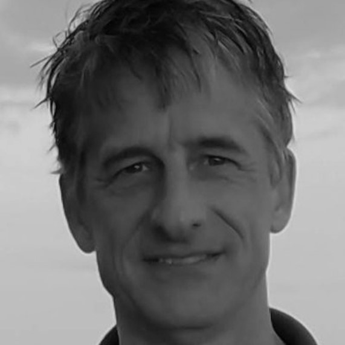

```js
import { createHeader } from "./components/header.js";
import { createFooter } from "./components/footer.js";
```

<div class="header-container">
  ${createHeader()}
</div>
<main id="main" tabindex="-1" class="about-container">
  <div class="about-content">
    <figure class="profile-image">
      
    </figure>
    <section class="about-section">
      <h2>Hi, I'm Ben Letcher</h2>
      <p>After a fun, invigorating and challenging career as a <a href="https://www.usgs.gov/staff-profiles/benjamin-h-letcher" rel="noopener noreferrer">research ecologist</a> with the US Geological Survey, I am now focusing on creating interactive data apps. While at USGS, with a large group of volunteers, technicians, undergrads, grad students, post-docs and colleagues, I spent a lot of time conducting and overseeing intensive fish tagging studies in a few small streams. There was also a lot of data analysis and modeling. You can find some early data stories/tools about the study area, the West Brook, <a href="https://www.usgs.gov/apps/ecosheds/pitdata/" rel="noopener noreferrer">here</a>. Wait, is that why this site is called WestBrook DataViz? Yup.</p> 
      <p>The West Brook is where I got to follow my dream of getting data on individual fish so we could understand how the fish grow, where they go, how likely they are to survive and who is related to who. </p>
      <p>Over almost 20 years, we collected data on about 30,000 fish. The trouble is that the data on these fish are really complex and the models are even more so. We needed creative ways to explore the data and explain the models. Working mainly with <a href="https://walkerenvres.com/" rel="noopener noreferrer">Dr Jeff Walker</a>, we developed the <a href="https://www.usgs.gov/apps/ecosheds/#/" rel="noopener noreferrer">EcoSheds</a> platform which links databases, ecological models and visualization tools. Working on EcoSheds has made it clear that data viz tools can provide key insights into the data and make it easier to share results with a broader audience.</p>
      <h2>My Goal</h2>
      <p>At WestBrook DataViz, I create interactive data visualizations and exploratory tools to help people understand complex environmental and ecological systems. My goal is to make scientific data and models more accessible and engaging through interactive experiences.</p>
    </section>
    <section class="about-section">
      <h2>I specialize in:</h2>
      <ul>
        <li>Environmental and ecological data analysis</li>
        <li>Interactive data explorers for scientific research</li>
        <li>Data storytelling through visualization</li>
        <li>Custom visualization tools for researchers and environmental resource managers</li>
      </ul>
    </section>
    <section class="about-section">
      <h2>I believe in:</h2>
      <ul style="list-style-type: none; padding-left: 0;">
        <li>Making data and ecological models accessible and engaging</li>
        <li>Increasing scientific literacy with exploratory tools</li>
        <li>Supporting scientific understanding</li>
        <li>Open source and reproducible science</li>
      </ul>
    </section>
  </div>
</main> 
<div class="footer-container">
  <hr>
  ${createFooter()}
</div>