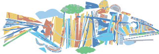

```js
import {
  createCaseCards,
  createCases,
  images,
  createFilterButtons,
  createFilteredCases,
  setupFilterButtons
} from "./components/cases.js";
import { html } from "htl";
import { createHeader } from "./components/header.js";
import { createFooter } from "./components/footer.js";
```

```js
const cases = await createCases(images)
const filterButtons = createFilterButtons();
const filteredCases = createFilteredCases(cases);
const displayedCards = filteredCases.update("all");
setupFilterButtons(filterButtons, filteredCases, createCaseCards);
```

<div class="header-container">
  ${createHeader()}
</div>
<main id="main" tabindex="-1" style="width: 100%">
  <!-- Hero Section -->
  <section class="hero-section">
    <div class="hero-content">
      <h1 class="hero-title">
        WestBrook Dataviz
      </h1>
      <p class="hero-desc">
        Making <span class="highlight">Data</span> Make Sense
      </p>
    </div>
  </section>
  <!-- Projects Section -->
  <div class="cases-container">
    <div class="filter-section">
      ${filterButtons}
    </div>
    <div class="cases-grid">
      ${await createCaseCards(displayedCards)}
    </div>
  </div>
  <!-- CTA Section -->
  <section class="cta-section">
    <h2 class="cta-title">Want to bring your data to life?</h2>
    <a href="contact.html" class="cta-btn">
      Get in Touch
      <span>→</span>
    </a>
  </section>
</main>
<div class="footer-container">
  ${createFooter()}
</div>

```js
//  <div class="svg-container">
//    
//  </div>
```
